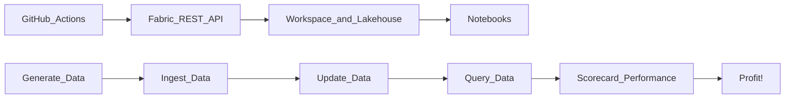

# Benchmark Fabric Framework (BFF)

This repository contains a modular, repeatable benchmarking framework for Microsoft Fabric. It supports synthetic data generation, ingestion strategies, update logic, query benchmarking, and scorecard reporting.

## 🚀 Purpose
To evaluate ingestion, update, and query performance across different formats, strategies, and access modes in Microsoft Fabric.

## 🔧 Features
- Automated Fabric workspace and lakehouse provisioning
- Notebook upload and configuration via REST API
- GitHub Actions for fully reproducible runs
- Secure secret management (no credentials in code)
- Modular, extensible Python scripts

## 🏗️ Architecture

*Workflows trigger scripts that provision Fabric resources and upload notebooks automatically.  Notebooks contain logic to ingest, update, query, and analyze performance.*

---

## 🛠️ Setup Instructions / Checklist

- [ ] Clone GitHub repo:  
  `git clone https://github.com/stuckerj1/bff.git`

- [ ] Fabric workspace created and assigned to Premium capacity  
  See 🏗️ Fabric Workspace Setup Details below for links

- [ ] Register Azure AD app:  
  Name: `FabricBenchmarkingProvisioner`

- [ ] Enable service principal access in Microsoft Fabric tenant settings:  
  - “Allow service principals to use Fabric APIs”  
  - “Allow service principals to create workspaces”

- [ ] Create secrets in GitHub → Settings → Secrets → Actions:  
  - `TENANT_ID`  (from Microsoft Entra > App registrations > FabricBenchmarkingProvisioner > Overview > Directory (tenant) ID)
  - `CLIENT_ID`  (from Microsoft Entra > App registrations > FabricBenchmarkingProvisioner > Overview >  Application (client) ID)
  - `CLIENT_SECRET`  (create and immediately copy from Microsoft Entra > App registrations > FabricBenchmarkingProvisioner > Certificates & secrets > New client secret > BFF Client Secret)
  - `ADMIN_OBJECT_ID` (from Microsoft Entra > Users > [Select user] > Overview > Object ID)
  - `CAPACITY_ID` (from Fabric > Admin Portal > Capacity settings > Actions > [Select capacity, e.g. Trial] > Actions > Capacity ID)
  - `AZURE_SQL_SERVER` (in format servername.database.windows.net ... if plain servername is used the ".database.windows.net" will be appended).
  - `AZURE_SQL_DB` (e.g., benchmarking)

- [ ] For testing Azure SQL Database as a data source, provision a `SQL Database` from the Azure Marketplace:
  - Note: You can use the Azure SQL Database free offer
      - When doing this manually in the portal, you will see an offer "Want to try Azure SQL Database for free?"
      - Click `Accept Offer` to make this a free instance.
      - You may need to search for an available region to put the free database.
  - Provide a unique server name and database name (e.g., benchmarking).
  - Enable `Allow Azure services and resources to access this server`.
  - Make yourself an admin on the server.
  - Grant `FabricBenchmarkingProvisioner` permissions using the following SQL code in `Query editor (preview)`.
     
```
-- create a contained user that maps to the service principal
CREATE USER [FabricBenchmarkingProvisioner] FROM EXTERNAL PROVIDER;

-- Data-plane roles for ingestion & metrics
ALTER ROLE db_datareader ADD MEMBER [FabricBenchmarkingProvisioner];
ALTER ROLE db_datawriter ADD MEMBER [FabricBenchmarkingProvisioner];

-- The SP needs to create tables/schemas during seeding:
ALTER ROLE db_ddladmin ADD MEMBER [FabricBenchmarkingProvisioner];

-- (temporary/testing only) full DB control:
-- ALTER ROLE db_owner ADD MEMBER [FabricBenchmarkingProvisioner];
```
- [ ] Confirm test case parameters in `config/parameter_sets.yml`
  - Datasets specifying number of rows and ratio of updates (new/change/delete rows).     
  - Parameter sets for each test scenario:  size, from, to, update strategy

- [ ] Confirm you have `Microsoft Fabric Capacity Metrics` workspace activated.
    - https://learn.microsoft.com/en-us/fabric/fundamentals/enable-workspace-monitoring

- [ ] Run GitHub Actions workflow: `1. Provision BFF-Controller and Action Workspaces`

- [ ] Confirm Workspaces created successfully:  
  - Workspace ID logged for BFF-Controller and a workspace for each ingestion scenario 
  - Admin role assigned with status code `201`  
  - Retry loop logs error metadata if assignment fails

- [ ] Run GitHub Actions workflow: `2. Provision Lakehouses & Warehouses`

- [ ] Confirm Lakehouses and Warehouse are created successfully:  
  - Names: `BenchmarkLakehouse` and `DataSourceLakehouse` and `BenchmarkWarehouse`
  - Description: "Lakehouse for benchmarking synthetic data and update strategies"  (similar for warehouse)
  - Created using `POST /v1/workspaces/{workspaceId}/lakehouses`  (similar for warehouse)
  - Confirm status code `201` and capture `lakehouse_ids` and `warehouse_id`

- [ ] Run GitHub Actions workflow: `3. Provision Notebooks`

- [ ] Run GitHub Actions workflow: `4. Run Benchmarks`

  - This calls a `4. Run Benchmarks` notebook which runs the other notebooks in order:

      `BFF-Controller` workspace
      - 0.GenerateData - Synthetic data generation

      In each action workspace
      - 1.IngestData - Initial data load 
      - 2.ApplyUpdates - Full refresh, full compare, increment, (CDC deferred)
      - 3.Queries - Capture query benchmarking  timings

- [ ] Manually run `5. Visualize Metrics` notebook in the `BFF-Controller` workspace
  - [ ] 5.VisualizeMetrics - Display metrics from capture
    - Note:  you may need to wait a day to see all the storage and capacity usage metrics, after `Microsoft Fabric Capacity Metrics` workspace refreshes its data

- [ ] Review metrics and gain insights.

Troubleshooting Steps If Needed:

- [ ] Confirm DataSourceLakehouse folder structure and data:  
  - `base/` → for initial datasets  
  - `updates/` → for increment (CDC deferred)  
  - Folder creation handled via 1.GenerateData notebook logic 

- [ ] Semantic model connected to Delta tables

- [ ] Power BI reports or PySpark charts created for scorecard, refresh latency, and query performance

- [ ] Shortcuts created and validated

- [ ] Fabric Capacity Metrics App installed

---


# 📘 BFF Documentation: Context, Structure and Process

## 🔧 Parameterized Dimensions

| Dimension | Values | 
| --- | --- | 
| `row_count` | 10K, 1M | 
| `format` | Delta, Warehouse | 
| `source` | Lakehouse, SQL | 
| `update_strategy` | Full Refresh, Full Compare, Increment (CDC deferred) | 

---

## 🏗️ External Source Simulation Strategy

### External Data Ingestion

To simulate ingesting data from an external system into Microsoft Fabric, the framework currently uses two source data options:
1. A **separate Fabric lakehouse** in the BFF-Controller workspace, which is distinct from the destination data / test case workspaces.
2. An **Azure SQL Database** (not in Fabric).

Synthetic datasets are generated and stored in the DataSourceLakehouse as files (Parquet) and the exact same data is copied into the Azure SQL Database. Multiple datasets can be created with different sizes.  This enables realistic benchmarking and makes it easy to automate and parameterize ingestion workflows.

**Why use a separate lakehouse?**
- Mirrors common real-world scenarios where data lands in a data lake before ingestion into Fabric.
- Enables shortcut creation and metadata sync latency measurement.
- Simplifies automation, setup, and reproducibility.
- Provides flexibility to later swap in other external sources (SQL DB, Blob Storage) with minimal workflow changes.

**Future extensibility:**  
The workflow is designed so you can easily add new source locations such as CSV in Azure Blob Storage, to benchmark those ingestion patterns.

**Note on Parquet File Compatibility for Spark and Pandas**
  - By default, pandas/pyarrow writes timestamps with nanosecond precision (`TIMESTAMP(NANOS)`), which Spark cannot read. Using millisecond precision (`coerce_timestamps='ms'`) avoids this issue. Parquet files created with pandas using `coerce_timestamps='ms'` can be read by both pandas and Spark.
  - Proven Practice:  Use `coerce_timestamps='ms'` in pandas `.to_parquet()` calls when you intend to read Parquet files with Spark in Microsoft Fabric or Databricks. Example: `df.to_parquet("path/to/file.parquet", coerce_timestamps="ms")`
  - References: 
        - [PyArrow Documentation: Parquet Timestamp Compatibility](https://arrow.apache.org/docs/python/generated/pyarrow.parquet.write_table.html)
        - [Spark Parquet Timestamp Support](https://spark.apache.org/docs/latest/sql-data-sources-parquet.html)
---

### Ingestion Targets

After simulating external data, the framework supports ingestion into three target types:

| Target Type           | Description                                   | 
|-----------------------|-----------------------------------------------|
| Delta (Lakehouse)     | Delta tables ingested into BenchmarkLakehouse |
| Warehouse             | Ingestion into BenchmarkWarehouse (SQL tables)|

- **Lakehouse (Parquet):** Used for Python-based metric charting and quick analysis.
- **Lakehouse (Delta) & Warehouse:** Used for Power BI reporting, scorecards, and advanced query performance metrics.

### Reporting Overview

- **Python charts** (matplotlib, seaborn, plotly) are used to visualize metrics.
- **Power BI reports** can also be created if wanted.

---

### Workflow Flexibility

The ingestion module is structured for easy swapping of external sources. To add new external sources:
- Implement new data generators or connectors (CSV in Blob, etc.) in the synthetic data and ingestion notebooks/scripts.
- Update the workflow to select the desired external source when running ingestion benchmarks.

---

## 🧩 Modular Components (0 and 4 run in BFF-Controller; 1-2-3 run in action workspaces)

### 0. Synthetic Data Generation
- **Purpose:** Create parameterized synthetic datasets (base and incremental slices) in DataSourceLakehouse.
- **Parameters:** `row_count` (e.g., 10K, 1M), schema, distribution, change %, insert %, delete %.
- **Output:** Parquet/Delta base data, increment update slices (CDC deferred).

### 1. Ingestion & Lakehouse/Warehouse Provisioning
- **Targets:** 
  - Parquet in BenchmarkLakehouse
  - Delta in BenchmarkLakehouse with shortcut in BenchmarkWarehouse
  - Copy in BenchmarkWarehouse
- **Note:** Includes step to provision BenchmarkWarehouse.

### 2. Update Strategy & Incremental Load Performance Testing
- **Strategies:** Full Refresh, Full Compare (append changes), Increment (append changes), (CDC deferred).
- **Purpose:** Benchmark updates for all targets.
- **Metrics:** Ingestion time, update latency, resource usage, reliability, correctness metrics.

### 3. Query Performance Testing
- **Modes:**
  - Notebook/Python (Parquet)
  - Power BI (Delta via shortcut)
  - Power BI (Warehouse copy)
- **Metrics:** Query time, refresh latency, resource usage.

### 4. Scorecard & Capacity/Cost Metrics Capture
- **Purpose:** Compile results, track workspace utilization, storage/compute footprint, refresh rates, and estimated cost per test case.
- **Tools:** Fabric Metrics App, notebook logging, Power BI dashboards, comparative tables.

## 📊 Sample Scorecard Layout

| Test Case |  Action | Target | Rows | Update Strategy | Ingest Time | Storage Size | Query Type | Query Time | Notes | 
| --- | --- | --- | --- | --- | --- | --- | --- | --- | --- | 
| TC.01.x | Load   | delta_refresh_load<br>delta_compare_load<br>delta_increment_load | per x | - | 3.2s | 12 MB | - | - | Initial load; benchmark only one | 
| TC.02.x | Load   | wh_table_refresh_load<br>wh_table_compare_load<br>wh_table_increment_load | per x | - | 3.2s | 12 MB | - | - | Initial load; benchmark only one | 
| TC.03.x | Update | delta_refresh_load     | per x | Full Refresh | 3.2s | 12 MB | - | - | Overwrite Target | 
| TC.04.x | Update | wh_table_refresh_load | per x | Full Refresh | 3.2s | 12 MB | - | - | Overwrite Target | 
| TC.05.x | Update | delta_compare_load     | per x | Full Compare | 3.2s | 12 MB | - | - | Compare and Append | 
| TC.06.x | Update | wh_table_compare_load | per x | Full Compare | 3.2s | 12 MB | - | - | Compare and Append | 
| TC.07.x | Update | delta_increment_load     | per x | Incremental | 3.2s | 12 MB | - | - | Append inserts/updates/deletes | 
| TC.08.x | Update | wh_table_increment_load | per x | Incremental | 3.2s | 12 MB | - | - | Append inserts/updates/deletes | 
| TC.09.x<br>(deferred) | Update | delta_cdc_load     | per x | CDC | 3.2s | 12 MB | - | - | Append inserts/updates/deletes with possible multiple updates per record | 
| TC.10.x<br>(deferred) | Update | wh_table_cdc_load | per x | CDC | 3.2s | 12 MB | - | - | Append inserts/updates/deletes with possible multiple updates per record | 
| TC.11.x | Query    | delta_increment_load                | per x | - | - | - | Aggregate | 1.2s | Notebook, measure performance | 
| TC.12.x | Query    | WH shortcut to delta_increment_load | per x | - | - | - | Aggregate | 1.2s | Power BI or Notebook, measure performance | 
| TC.13.x | Query    | wh_table_increment_load             | per x | - | - | - | Aggregate | 1.2s | Power BI or Notebook, measure performance | 
| TC.14.x | Storage Check | delta_refresh_load<br>delta_compare_load<br>delta_increment_load     | - | - | - | 12 MB | - | - | Size & cost of storage | 
| TC.15.x | Storage Check | wh_table_refresh_load<br>wh_table_compare_load<br>wh_table_increment_load | - | - | - | 12 MB | - | - | Size & cost of storage | 
| TC.16.x | Metrics | All | - | - | - | - | - | - | Notebook or Power BI | 

---

## 🙏 Acknowledgments

- Uses [dawidd6/action-download-artifact](https://github.com/dawidd6/action-download-artifact) for workflow artifact management.
